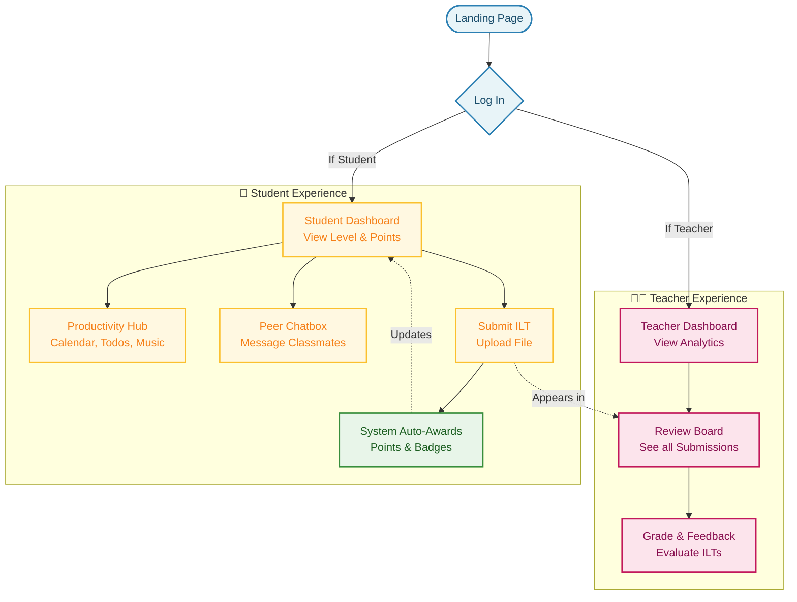

# The Actual Coding Journey: Building Talino-Ruiziano

This document outlines the actual step-by-step programming and development process used to build the Talino-Ruiziano platform. It includes the real tools and commands we used, along with plain-English explanations of what they do.

---

## 📖 Glossary of Actual Technical Terms

*   **Vite:** A build tool that creates the foundation for our web project and makes the website load incredibly fast while we are coding it.
*   **React:** A JavaScript library that lets us build the user interface out of reusable "components" (like putting Lego blocks together).
*   **TypeScript:** A stricter version of JavaScript that catches errors in our code before the website even runs.
*   **Tailwind CSS:** A tool that lets us style the website (colors, spacing, fonts) by writing short class names directly in our code instead of writing separate, long CSS files.
*   **shadcn/ui:** A collection of pre-designed, accessible components (like buttons, dialog boxes, and forms) that we copied into our project to speed up development.
*   **Supabase:** The backend-as-a-service platform we used. It provides our PostgreSQL database, handles user logins (Authentication), and stores uploaded files (Storage).
*   **SQL (Structured Query Language):** The language we use to tell the Supabase database how to create tables, save data, and run automatic triggers.

---

## 🚀 The Web Application User Flow

Before we look at the programming steps, here is how the users (Students and Teachers) actually move through the Talino-Ruiziano website:

### User Journey Overview


---

## 🛠️ The Actual Step-by-Step Programming Process
The first step was to create the empty folder in our computer and set up the core React application using Vite.
1.  We opened the terminal screen and ran the command to scaffold a new React + TypeScript project:
    ```bash
    npm create vite@latest study-spark -- --template react-ts
    ```
2.  We navigated into the folder and installed the base packages required to run the code:
    ```bash
    cd study-spark
    npm install
    ```

### Step 2: Adding Styling and UI Components
Next, we configured Tailwind CSS and shadcn/ui to build the visual foundation.
1.  We installed Tailwind CSS and its required configuration files:
    ```bash
    npm install -D tailwindcss postcss autoprefixer
    npx tailwindcss init -p
    ```
2.  We configured our `tailwind.config.ts` file to include our specific brand colors (Maroon, Cream, Golden Yellow).
3.  We initialized `shadcn/ui` to easily generate components like buttons, input fields, and dialog boxes:
    ```bash
    npx shadcn-ui@latest init
    ```

### Step 3: Setting Up the Supabase Backend
Before building the actual pages, we needed our database ready to store information securely in the cloud.
1.  We created a project on the Supabase website.
2.  We ran SQL commands in the Supabase dashboard to create our necessary tables:
    *   `profiles` (to store user avatars, roles, points, and streaks).
    *   `submissions` (to store the ILT files students upload).
    *   `messages` (to store the chatroom history).
3.  We connected our React app to Supabase by copying our private API keys into a secure `.env` file:
    ```env
    VITE_SUPABASE_URL=our_actual_url
    VITE_SUPABASE_ANON_KEY=our_actual_key
    ```

### Step 4: Programming the Frontend Layout and Pages
With the database ready, we started writing code in our `src/` folder to build the pages the users actually see.
1.  **Routing:** We used `react-router-dom` to create different page destinations (e.g., `/dashboard`, `/submit-ilt`, `/admin`).
2.  **Components:** We built reusable pieces in `src/components/`, such as `MusicPlayer.tsx` for the lo-fi radio and `ChatBox.tsx` for real-time messaging.
3.  **Pages:** We built the main screens in `src/pages/`. For example, in `SubmitILT.tsx`, we wrote the code that lets students drag and drop their files.

### Step 5: Connecting the App to the Database (Fetching Data)
We had to write functions that allowed the frontend to read from and write to Supabase.
1.  We used the `@supabase/supabase-js` library to write code that fetches data. For example, to get a user's points safely:
    ```typescript
    const { data } = await supabase.from('profiles').select('points').eq('id', userId);
    ```
2.  We set up **Realtime Subscriptions** for the chatroom. This code tells the website to instantly update the screen whenever a new message is added to the database by another student, without needing to refresh the page.

### Step 6: Implementing Gamification (Points, Streaks, Badges)
The final major step was programming the game logic. Instead of doing this all in React on the user's computer, we wrote **Database Triggers** in SQL directly inside Supabase to make it automatic and secure.
1.  We wrote an `increment_streak` function that checks when a student last logged in, and updates their consecutive days count.
2.  We wrote an `award_points` function that automatically adds 50 points to a student's profile the exact moment their file is successfully inserted into the `submissions` table.
3.  We added logic to check if a student had reached a milestone (like 1000 points) and automatically awarded them a "Scholar" badge.

### Step 7: Testing and Deployment
1.  We ran the app locally on our computers using `npm run dev` to test everything.
2.  We squashed bugs, fixed layout issues on mobile screens, and ensured the secure file uploads worked correctly.
3.  Finally, we built the final version of the site (`npm run build`) and deployed it so students and teachers could access it live on the internet.
